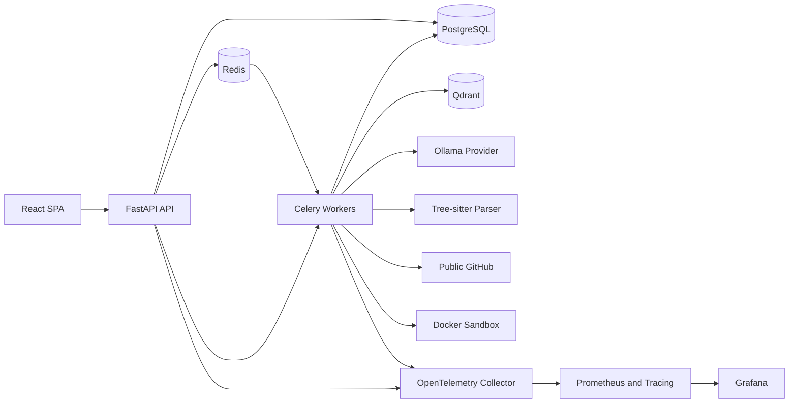
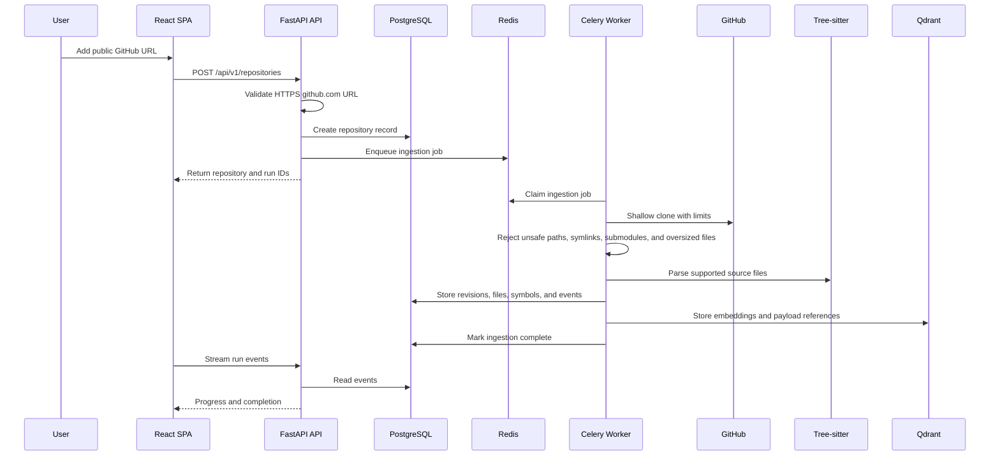
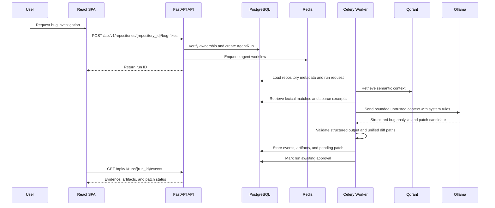
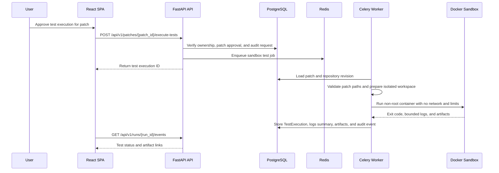

# System Overview

## Product Overview

CodePilot is a self-hosted Multi-Agent Software Engineering Assistant for public GitHub repositories. It ingests repository source code, extracts syntax-aware structure, builds lexical and semantic indexes, answers questions with citations, investigates bugs, proposes patches, generates tests, executes approved tests in a sandbox, reviews changes, generates documentation, and records auditable run history.

The system is designed for local or trusted single-tenant deployment without paid AI APIs. Ollama is the default local model provider, and provider interfaces allow future alternatives.

## User Journeys

- A user registers, logs in, refreshes a session, views their profile, and logs out.
- A user adds a public GitHub repository and watches ingestion progress.
- A user browses indexed files and symbols.
- A user asks a codebase question and receives an answer with exact file and line citations.
- A user asks for a bug investigation and receives root cause analysis, evidence, and an optional patch.
- A user reviews a generated patch, approves or rejects it, validates it, and optionally applies it.
- A user approves sandbox test execution for a generated patch and reviews logs and artifacts.
- A user requests automated code review or documentation and receives artifacts tied to the run.

## Component Responsibilities

- React frontend: authenticated dashboard, repository management, streamed run progress, artifacts, patch review, and approval workflows.
- FastAPI API: request validation, response shaping, exception mapping, dependency injection, run orchestration, event streaming, and thin HTTP routes.
- Service layer: business rules for repositories, ingestion, retrieval, runs, patches, artifacts, audits, approvals, database health, Redis health, and idempotency reservations.
- Repository classes: database access boundaries for PostgreSQL models.
- Celery workers: long-running ingestion, indexing, agent runs, sandbox execution, artifact creation, and scheduled maintenance jobs.
- PostgreSQL: source of truth for durable application state, migration metadata, repository records, revisions, files, symbols, runs, events, artifacts, patches, test executions, refresh tokens, audit logs, and system metadata.
- Redis: Celery broker, result backend, idempotency reservations, and transient queue data.
- Qdrant: vector index for semantic code retrieval.
- Ollama provider: local chat and embedding inference behind provider interfaces.
- Tree-sitter parser: syntax-aware parsing and symbol extraction.
- Docker sandbox runner: isolated execution for approved tests with no network and strict resource limits.
- Observability stack: metrics, traces, logs, dashboards, and correlation IDs.

## Data Flow

1. The frontend sends authenticated requests to the API.
2. The API validates ownership, records intent, and enqueues long-running work.
3. Workers clone and inspect public GitHub repositories using strict limits.
4. Workers persist repository metadata, files, symbols, events, and artifacts in PostgreSQL.
5. Workers build lexical indexes in PostgreSQL and semantic indexes in Qdrant.
6. Agent workflows retrieve bounded context from PostgreSQL and Qdrant.
7. Ollama returns model output through typed provider interfaces.
8. Structured output is validated before storage.
9. Patches and execution requests wait for explicit human approval.
10. The frontend streams run events and fetches artifacts.

## Background Job Flow

- The API creates an `AgentRun` or ingestion record with an idempotency key where needed.
- The API enqueues a Celery task and returns the durable run identifier.
- Workers emit `AgentRunEvent` records for state transitions and progress.
- Workers store artifacts, patches, validation results, and test execution records.
- Cancellation requests mark runs as canceling and workers stop at safe checkpoints.
- Failed jobs record structured error information without leaking secrets or source contents.

## Agent Workflow

CodePilot uses deterministic LangGraph workflows. Not every request uses every node.

Planned nodes:

- `request_validator`
- `intent_router`
- `repository_context_builder`
- `retriever`
- `code_reader`
- `bug_analyst`
- `patch_generator`
- `test_generator`
- `static_analyzer`
- `sandbox_test_runner`
- `code_reviewer`
- `documentation_generator`
- `approval_gate`
- `finalizer`

Each node receives bounded context, treats repository content as untrusted data, returns typed structured output, records evidence and file references, and logs prompt version, model identifier, duration, status, and error information.

## Storage Boundaries

- PostgreSQL is the durable source of truth.
- Qdrant stores embeddings and vector payload metadata, not authorization truth.
- Redis stores transient queue, result, and idempotency reservation data only.
- Object-like artifacts may initially live in PostgreSQL or a local artifact store, but metadata and ownership live in PostgreSQL.
- Cloned repositories live in controlled worker storage with cleanup policies and must never be treated as durable truth.
- Logs and traces must exclude secrets, JWTs, authorization headers, passwords, and raw source-code contents.

## Trust Boundaries

- Browser to API: authenticated HTTP boundary.
- API to worker queue: internal service boundary.
- Worker to public GitHub: untrusted network input boundary.
- Repository content to parser, retriever, and model prompt: untrusted content boundary.
- Model output to application storage: untrusted generated data boundary.
- Patch to validation and application: untrusted diff boundary.
- Test execution to Docker sandbox: approved but still untrusted execution boundary.
- Internal services to PostgreSQL, Redis, Qdrant, Ollama, and observability services: private network boundary.

## Component Diagram

## Repository Ingestion Sequence

## Bug-Fix Generation Sequence

## Approved Sandbox Test Execution Sequence

